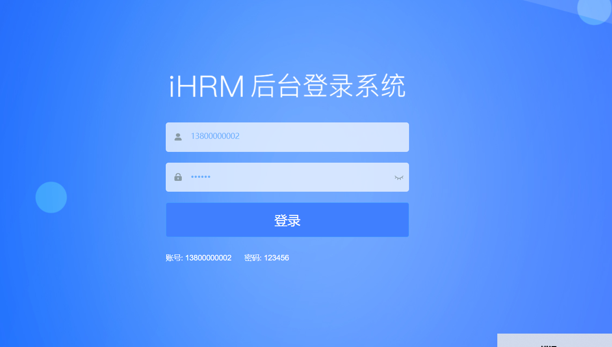

## 反馈

登录模块

>  页面布局



>  表单校验

```vue
<el-form :model="{}" :rules="{}">
    <el-form-item prop="">
         <el-input v-model="">
```

>  校验规则

```js
{
    required: true,  // 表示必填
    message: '',  // 提示消息
    trigger: 'blur/change', // 触发方式
    min: 6, // 最小长度 或者最小值
    max: 16, // 最大长度 或者最大值
    pattern: /^1[3-9]\d{9}$/, // 正则表达式
    validator: function (rule, value, callback) {
        // value是校验的值
        value ? callback() : callback(new Error())
    }
}
```


## 上午复习

跨域处理

>  cors 后端设置前端可以访问

后端设置 ： *  全部都可以访问，绝对不可能在生产环境中应用的

后端设置： cors  局部可用 ， 可以设置某个地址的请求 可以跨域

http://localhost:8888

jsonp: 跨域，缺陷明显， get，传参形式受影响

代理

### vue-cli跨域代理

> 解决开发环境下的跨域代理

```js
modules.exports = {
    devServer: {
        proxy: {
            '/api': {
                target: 'http://www.baidu.com',
                changeOrigin: true,
                // localhost:8888/api/user => http://www.baidu.com/api/user
                // 如果想要 http://www.baidu.com/user
                pathRewrite: {
                    '^/api': ''
                }
            }
        }
    }
}
```

### 封装登录接口

```js
export function login (data) {
    return request({
        method: 'post',
        url: 'sys/login',
        data
    })
}
```

### 封装用户模块的action管理token

```js
import {getToken, setToken, removeToken} from '@/utils/auth'
const state = {
    token: getToken()  // 持久化token
}
const mutations = {
    setToken (state,token) {
        state.token = token
        setToken(token)
    },
    removeToken() {
        state.token = null
        removeToken()
    }
}
import { login }  from '@/api/user'
const actions = {
  async login(context, data) {
     const result =  await login(data)
     context.commit("setToken", result)
    }
}
```

### axios的基础地址和响应拦截器设置

```js
const service =  axios.create({
    baseUrl: process.env.VUE_APP_BASE_URL // 不同环境 不同的地址  开发环境  /api 生产环境 /prod-api
})
```

```js
service.interceptors.response.use(response => {
    const  { success, data, message } = response.data
    if (success) {
        return data
    }else {
        Message.error(message)
       return Promise.reject(new Error(message))
  }
},error => {
    Message.error(error.message)
    return Promise.reject(error)
})
```

### 调用action

```js
this.$refs.loginForm.validate(async isOK => {
    this.loading = true
    try {
       await this['user/login'](this.loginForm)
      this.$router.push('/')
    } catch () {
    }finally {
        this.loading= false
    }

})
```


## 下午复习

登录

> 调用登录接口 ，跳到主页

接口是跨域的

> 解决开发环境跨域，vue-cli跨域代理

修改vue.config.js必须重启才能生效

```js
proxy: {
    '/dev-api': {
        target: 'http://baidu.com', // http://baidu.com/dev-api/user 
        changeOrigin: true,
        pathRewrite: {
            '^/dev-api': ""
        }
    }
}
```

登录接口

```js
export function login (data) {
    return request({
        url: 'sys/login',
        method: 'post',
        data
    })
}
```

Vuex管理token, 封装了登录action

```js
import  {getToken,setToken, removeToken}  from '@/utils/auth'
const state = {
    token: getToken()  // 初始化时 从缓存中读取
}
const mutations = {
    setToken (state,token) {
        state.token = token
        setToken(token)
    },
      removeToken (state) {
        state.token = null
        removeToken()
    }
}
import { login } from '@/api/user'
const actions = {
    // 认为data是 { mobile, password }
   async login (context, data) {
      const result = await login(data)
      // result默认加了一层data
      if (result.data.success) {
          // 只有为true 才认为登录成功
       context.commit('setToken', result.data.data)  
      }
    }
}
```

区分了不同环境的下变量地址

```js
const service = axios.create({
    baseUrl: process.env.VUE_APP_BASE_URL  // 开发环境  /dev-api  生产环境  /prod-api
})
```

响应拦截器的数据处理

```js
service.interceptors.response.use(response => {
   const { success, message, data } = response.data
   if (success) {
       return data
   }else {
        Message.error(messsage)
       return Promise.reject(new Error(message))
   }
}, error => {
    Message.error(error.messsage)
    return Promise.reject(error)
})
```

调用action

```js
this.$refs.loginForm.validate(async isOK => {
    if (isOK) {
        this.loading = true
        try {
          // await下方的代码永远只是reslove之后的结果
          await this['user/login'](this.loginForm)
          this.$router.push('/')
        } catch(){
            
        }finally () {
            this.loading = false
        }

    }
})
```


主页

> token拦截权限


```js
router.beforeEach((to, from, next) => {
    if (store.getters.token) {
        if(to.path === '/login') {
            next('/')
        }else {
            next()
        }
    }else {
        if(whiteList.indexOf(to.path) > -1) {
            next()
        }else {
            next('/login')
        }
    }
})
```

> 左侧导航菜单
>
> 头部navbar

注入token

```js
export function  getUserInfo () {
    return request({
        url: '',
        method:'',
        headers: { Auth }
    })
}
```

axios的请求拦截器去做

```js
axios.interceptors.request.use(config=> {
    if(store.getters.token) {
        config.headers.Authorization = `Bearer ${store.getters.token}`
    }
    
    return config
}, error=> {
    return Promise.reject(error)
})
```

