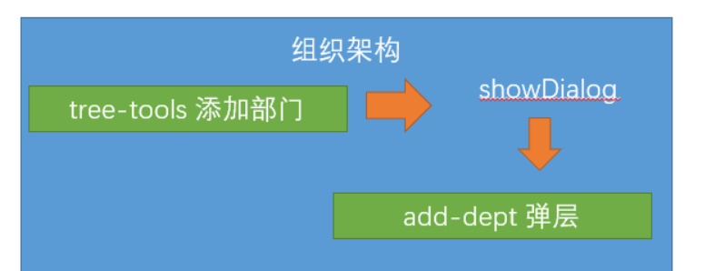
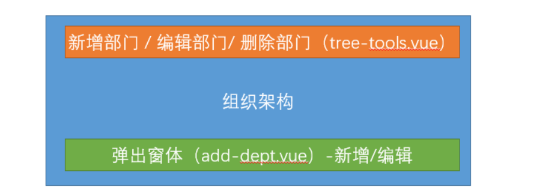
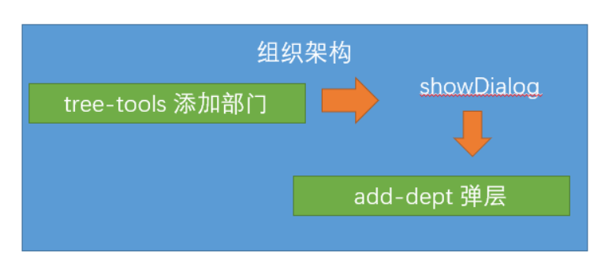

## 反馈和复习

组织架构

>   element-ui  组件 tree

```vue
<el-tree :data="treeData" :props="defaultProps" />
export default {
 data () {
    return  {
       defaultProps: { label: 'name',children: 'child' },
       treeData: [{ name: '张三', child: [{ name: '张三丰', child: { name： ’张翠山'} }]
   }
  }
}
```

递归算法

>  接口返回的并不是这种结构，而是一种列表型的结构

递归就是自身调用自身，必须要有跳出条件 ， 每次传递的参数不一样	

```html
<!DOCTYPE html>
<html lang="en">
<head>
    <meta charset="UTF-8">
    <meta name="viewport" content="width=device-width, initial-scale=1.0">
    <title>递归小案例</title>
</head>
<body>
    <ul id="myUL"></ul>
    <script>
        var  treeData = [{ name: '努尔哈赤',child: [{ name: '皇太极', child: [{ name: '顺治',child: [{ name: '康熙', child: [{ name: "胤祉" },{ name: "胤礽" },{ name: '雍正',
        child: [{name: '弘昼'},{name: '弘时'},{ name: '乾隆',child: [{ name: '嘉庆', child: [{ name: '道光',child: [{name:  '咸丰',child: [{name: '同质', child: [{ name: '光绪', child:[{ name: '宣统' }] }]}] }] }] }] }] }] }] }] }] },]
        var dom = document.getElementById("myUL")
        // 递归方法
        var transDataToHtml  = function (list) {
            var str = ""
            list.forEach(item => {
                str += `<li>${item.name}`
                if (item.child && item.child.length) {
                    // 找儿子
                 str += `<ul>${transDataToHtml(item.child)}</ul>` 
                }
                str += '</li>'
            });
            return str
        }
        dom.innerHTML = transDataToHtml(treeData)
    </script>
</body>
</html>
```

删除组织架构

```js
        this.$confirm('您是否确定要删除该部门吗').then(() => {
          return delDepartments(this.treeNode.id)
        }).then(() => {
          // 此时已经确定
          // 应该告诉父组件 更新数据
          this.$emit('delDepts')
          this.$message.success('删除部门成功')
        }).catch(() => {
            this.$message.error("删除失败")
        })
```


## 上午复习

组织架构

>   新增 

新建弹层组件   add-dept.vue

```vue
<el-dialog title="新增部门" :visible="showDialog">
    <!-- 弹层内容 -->
    <el-form ref="deptForm" :model="formData" :rules="rules" label-width="120px">
      <el-form-item label="部门名称" prop="name">
        <el-input v-model="formData.name" style="width:80%" placeholder="1-50个字符" />
      </el-form-item>
      <el-form-item label="部门编码" prop="code">
        <el-input v-model="formData.code" style="width:80%" placeholder="1-50个字符" />
      </el-form-item>
      <el-form-item label="部门负责人" prop="manager">
        <el-select v-model="formData.manager" style="width:80%" placeholder="请选择负责人" @focus="getEmployeeSimple">
          <el-option v-for="item in peoples" :key="item.id" :label="item.username" :value="item.username" />
        </el-select>
      </el-form-item>
      <el-form-item label="部门介绍" prop="introduce">
        <el-input v-model="formData.introduce" type="textarea" :rows="4" style="width:80%" placeholder="1-300个字符" />
      </el-form-item>
    </el-form>
    <!-- 放置居中的按钮 -->
    <el-row slot="footer" type="flex" justify="center">
      <!--放置列 -->
      <el-col :span="8">
        <el-button>取消</el-button>
        <el-button type="primary" @click="btnOK">确定</el-button>
      </el-col>
    </el-row>
  </el-dialog>
```

变量控制 弹层显示 /隐藏

```js
	props: {
    showDialog: {
      type: Boolean,
      default: false
    },
    treeNode: {
      type: Object,
      default: null
    }
  },
```




>   校验

校验同级部门下不能有重复的部门名称

```js
const checkNameRepeat = async(rule, value, callback) => {
      // 校验逻辑 同级部门不能出现重复的名称
      // 获取最新的组织架构数据
      const { depts } = await getDepartments()
      // depts是所有的数据
      // 市场部所有的子部门的 pid 等于市场部的id  市场部的数据的treeNode.id
      const isRepeat = depts.filter(item => item.pid === this.treeNode.id).some(item => item.name === value)
      isRepeat ? callback(new Error(`同级部门下已经有${value}这个部门了`)) : callback()
    }
```

```js
 const checkCodeRepeat = async(rule, value, callback) => {
      // 获取最新的组织架构数据
      const { depts } = await getDepartments()
      const isRepeat = depts.some(item => item.code === value) // 只要发现编码重复 就不行
      isRepeat ? callback(new Error(`已经有${value}这个编码了`)) : callback()
    }
```

新增逻辑

```js
    btnOK() {
      this.$refs.deptForm.validate().then(() => {
        // 如果进入then表示校验成功
        // 子部门的pid 等于父部门的id
        return addDepartments({ ...this.formData, pid: this.treeNode.id })
      }).then(() => {
        // 已经新增成功
        this.$emit('addDepts') // 触发自定义事件
      })
    }
```


组织

## 下午复习

>   组织架构

CRUD

> restful接口规范

```js
编辑场景
读取组织架构的详情
父组件  =>调用子组件方法   ref
this.$refs.addDept 拿到的是 add-dept组件的实例，也就是它的this
```

```js
 async editDepts(node) {
      await this.$refs.addDept.getDepartDetail(node.id)
      this.showDialog = true
      this.node = node // 记录当前点击的编辑节点
      // 调用子组件方法？父组件  => 子组件方法
    }
```

```js
  async  getDepartDetail(id) {
      this.formData = await getDepartDetail(id)
    }
```

编辑场景的校验规则

```js
 const checkNameRepeat = async(rule, value, callback) => {
      // 校验逻辑 同级部门不能出现重复的名称
      // 获取最新的组织架构数据
      const { depts } = await getDepartments()
      let isRepeat = false
      if (this.formData.id) {
        // 编辑
        // 找到自己当前部门的所有的同级部门
        isRepeat = depts.filter(item => item.pid === this.formData.pid && item.id !== this.formData.id).some(item => item.name === value)
      } else {
        // 新增场景
        isRepeat = depts.filter(item => item.pid === this.treeNode.id).some(item => item.name === value)
      }
      // depts是所有的数据
      // 市场部所有的子部门的 pid 等于市场部的id  市场部的数据的treeNode.id
      isRepeat ? callback(new Error(`同级部门下已经有${value}这个部门了`)) : callback()
    }
    const checkCodeRepeat = async(rule, value, callback) => {
      // 获取最新的组织架构数据
      const { depts } = await getDepartments()
      let isRepeat = false
      if (this.formData.id) {
        // 编辑
        isRepeat = depts.filter(item => item.id !== this.formData.id).some(item => item.code === value)
      } else {
        isRepeat = depts.some(item => item.code === value) // 只要发现编码重复 就不行
      }
      isRepeat ? callback(new Error(`已经有${value}这个编码了`)) : callback()
    }
```





sync

```vue
<child :title.sync="name" />
 this.$emit("update:title", '张三')
```

```vue
<child :title="name" @changeTitle="changeTitle" />
 this.$emit("changetitle", '张三')
changeTitle(name) {
this.name = name
}
```


