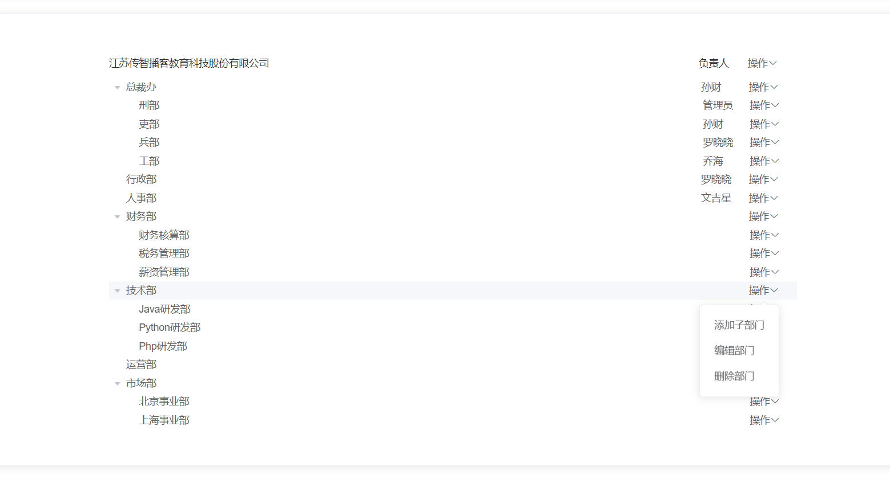
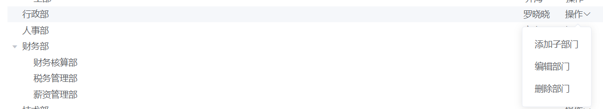
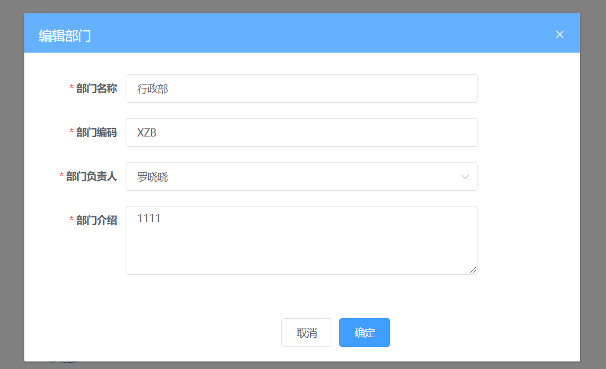

## 反馈和复习

| 姓名 | 意见或建议                                                   |
| ---- | ------------------------------------------------------------ |
| ***  | 咋整， 自己写代码就是写不出来，憋半天头都大了，不知道从何处下手 |



父组件 index.vue



工具栏组件  tree-tools.vue





传过来的数据 不是树形数据

>  将列表数据转化树形数据    树形递归算法

自身调用自身，一定要有跳出条件，每次调用的参数不能一样

```js
function transListToTreeData (list, rootValue) {
    var arr = []
    list.forEach(item => {
        if(item.pid === rootValue) {
          const children =  transListToTreeData(list, item.id)
          if (children.length) {
              item.children = children
          }
            arr.push(item)
        }
    })
    return arr
}
```

关闭弹层

sync 修饰符

```js
this.$emit("changeTitle", '张三')
```

```vue
<child :title="name" @changeTitle="changeTitle" />
export default {
data () {
return  {  
   name: '李四'
}
},
methods: {
 changeTitle (value) {
  this.name = value
 } 
}
}
```

```js
this.$emit("update:title",'张三')
<child :title.sync="name"  />

```


弹层

## 上午复习

角色的管理 CRUD

```js
import request from '@/utils/request'
export function getRoleList(params) {
  return request({
    url: '/sys/role',
    params
  })
}

export function deleteRole(id) {
  return request({
    url: `/sys/role/${id}`,
    method: 'delete'
  })
}
/** *
 * 修改角色
 * ***/
export function updateRole(data) {
  return request({
    url: `/sys/role/${data.id}`,
    data,
    method: 'put'
  })
}
/**
   * 获取角色详情
   * **/
export function getRoleDetail(id) {
  return request({
    url: `/sys/role/${id}`
  })
}

/** *
 * 新增角色
 * ***/
export function addRole(data) {
  return request({
    url: '/sys/role',
    data,
    method: 'post'
  })
}

```

sync

```js
子组件改父组件的值
element 也有sync修饰符  this.$emit("update:currenPage")
```

插槽   v-slot放在template标签上 

<child  slot="before" slot-scope="{  obj }">

```js
<template  v-slot:default ="{ obj }">
<template  v-slot:before="{ obj }">
```

## 下午复习

restful接口规范

>  角色管理

el-table可以设置border边框  stripe斑马线  设置列的序号显示索引

```vue
<el-table-column type="index">
```

**sync修饰符**

子组件

```vue
this.$emit("update:props属性", "值")
```

父组件

```vue
<child  :title.sync="name" >
```

**插槽**

v-slot

```vue
<template v-slot:default >
<template v-slot:before >
 <template v-slot:before="obj" > 等于   <template slot="before" slot-scope="obj" >
```


> 员工管理

table组件的知识

el-table-column 格式化内容  formatter

```vue
<el-table-column  :formatter="method">
    method(row, column, cellValue, index) {
       return ""
    }
```

过滤器 

```js
表达式 | 过滤器 | 过滤器
```

vue3取消了，建议我们用计算属性来代替

组合API